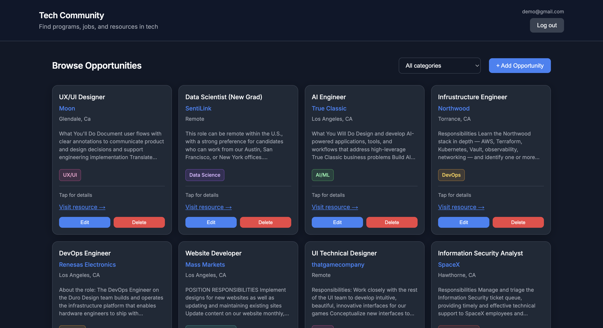
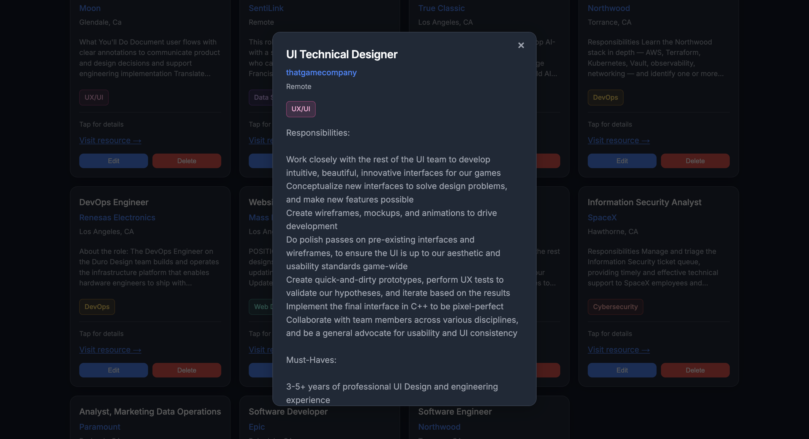
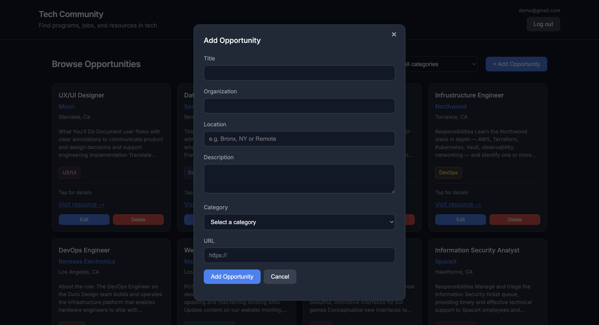

# Tech Community - Community Resource Board

A full-stack community resource board where people in tech can browse, share, and manage opportunities — internships, programs, events, and more.

---

## Demo & login

| | |
|---|---|
| **Live app** | https://tech-community-mackaylarodriguezs-projects.vercel.app |
| **Demo email** | `demo@gmail.com` |
| **Demo password** | `Demo1234!` |

## Demo Video

[](https://www.loom.com/share/848c96df7df348dba5eedcf3bd1b5b5f)

---

## Screenshots

| Home — browse & filter | Opportunity detail modal | Add / edit (logged in) |
|:---:|:---:|:---:|
|  |  |  |

---

## Project description

In our TKH Slack, fellows share useful links across different channels, but they get buried fast. **Tech Community** was created for The Knowledge House fellows to share opportunities and great resources in one place where you can browse, filter, and post listings. 

**What you can do:**
- Browse all opportunities (no login required)
- Filter by category (Software Engineering, Web Development, Cybersecurity, etc.)
- Register / log in to add opportunities
- Click a card to open full details in a popup
- Edit or delete only your own posts

---

## Tech stack

| Layer          | Technology               |
|----------------|--------------------------|
| **Frontend**   | Next.js (React), CSS     |
| **Backend**    | Node.js, Express.js      |
| **Database**   | PostgreSQL (Supabase)    |
| **Deployment** | Vercel, Render, Supabase |

---

## Bonus features

- **Authentication** — register/login with bcrypt + JWT; only logged-in users can post; only the creator can edit or delete their own listings.
  **Why:** So resources are tied to real users and no one can change or remove someone else's post.
- **Responsive design** — layout adapts from phone to desktop using CSS Grid and media queries.
  **Why:** Opportunities are often checked on a phone, so the app needed to work on any screen size.

---

## Known bugs & limitations

- **Render free tier cold starts:** The API may take 30–60 seconds to respond if it has been idle.

---

## What I'd do differently / add with more time

- **Password reset** — email flow for forgotten passwords
- **Filter by location** — e.g. Remote, NYC, etc.
- **Separate Tabs** — expand it into separate sections — tabs for **resources**, **learning**, **events**, and more 
  
---

## Project structure
```
├── client/                         # Next.js frontend (React)
│   ├── app/
│   │   ├── layout.js               # Root layout, fonts, metadata, wraps app in AppShell
│   │   ├── page.js                 # Home page — renders HomeContent
│   │   └── globals.css             # Global styles, layout grid, responsive breakpoints
│   ├── components/
│   │   ├── AppShell.js             # Navbar, auth controls, page wrapper
│   │   ├── AuthProvider.js         # React context for login state across the app
│   │   ├── AuthPanel.js            # Register / login form UI
│   │   ├── HomeContent.js          # Main page logic — filter, add/edit/delete, modals
│   │   ├── ResourceList.js         # Fetches resources from API, handles loading/errors
│   │   ├── ResourceCard.js         # Single opportunity card in the grid
│   │   ├── ResourceModal.js        # Popup with full opportunity details
│   │   ├── AddResourceForm.js      # Form to create or update a resource
│   │   ├── FormModal.js            # Modal wrapper for the add/edit form
│   │   └── CategoryTag.js          # Colored category badge on each card
│   ├── lib/
│   │   ├── api.js                  # All fetch() calls to the Express API
│   │   ├── auth.js                 # JWT token + user storage in localStorage
│   │   └── constants.js            # Category list and shared frontend constants
│   ├── public/                     # Static assets (icons, etc.)
│   ├── .env.example                # Example frontend env vars (API URL)
│   ├── next.config.mjs             # Next.js configuration
│   └── vercel.json                 # Vercel deployment settings
│
├── server/                         # Express backend (Node.js)
│   ├── controllers/
│   │   ├── resourceController.js   # CRUD logic for opportunities (GET/POST/PUT/DELETE)
│   │   └── authController.js       # Register, login, and current-user logic
│   ├── middleware/
│   │   └── authMiddleware.js       # Verifies JWT on protected routes
│   ├── routes/
│   │   ├── resources.js            # Maps /api/resources to resourceController
│   │   └── auth.js                 # Maps /api/auth to authController
│   ├── db/
│   │   └── db.js                   # PostgreSQL connection pool (Supabase)
│   ├── server.js                   # App entry point — CORS, routes, health check
│   └── .env.example                # Example backend env vars (DB URL, JWT secret)
│
├── docs/
    └── screenshots/                # README screenshots
```
---

## Setup & Installation

### 1. Clone the Repository

```bash
git clone https://github.com/mackaylarodriguez/tech-community.git
cd tech-community
```

---

### 2. Set Up the Database

This project uses **PostgreSQL on Supabase** (free tier). You do not need to install Postgres locally.

1. Create a project at [supabase.com](https://supabase.com) (or use your existing one).
2. Go to **Project Settings → Database** and copy your **connection string**.
3. Make sure your `users` and `resources` tables already exist in Supabase (they should if you deployed the app).

---

### 3. Set Up the Backend

Navigate to the server folder and install dependencies:

```bash
cd server
npm install
```

Create your environment file:

```bash
cp .env.example .env
```

On Windows:

```bash
copy .env.example .env
```

Open `server/.env` and fill in your values:

```env
DATABASE_URL=your_supabase_connection_string
JWT_SECRET=any_long_random_string
PORT=3001
```

- `DATABASE_URL` — your Supabase PostgreSQL connection string
- `JWT_SECRET` — any secret string (required for login)
- `PORT=3001` — keeps the API off port 3000 so it doesn't clash with Next.js

---

### 4. Set Up the Frontend

Navigate to the client folder and install dependencies:

```bash
cd ../client
npm install
```

Create your environment file:

```bash
cp .env.example .env.local
```

On Windows:

```bash
copy .env.example .env.local
```

Open `client/.env.local` and point it at your local backend:

```env
NEXT_PUBLIC_API_URL=http://localhost:3001
```

---

## Running the Application

You need two terminal windows — one for the backend, one for the frontend.

**Terminal 1 — Start the Express backend:**

```bash
cd server
npm run dev
```

You should see:

```
✅ Connected to PostgreSQL
🚀 Server running on port 3001
```

Check **http://localhost:3001/api/health** to confirm the database is connected.

**Terminal 2 — Start the Next.js frontend:**

```bash
cd client
npm run dev
```

You should see:

```
▲ Next.js ...
- Local: http://localhost:3000
```

Open your browser and go to **http://localhost:3000** to view the app.

---

## Author

Mackayla Rodriguez 
